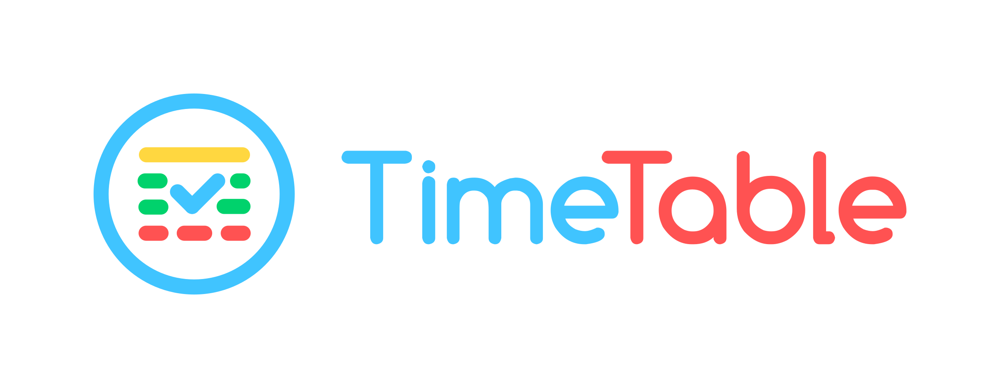
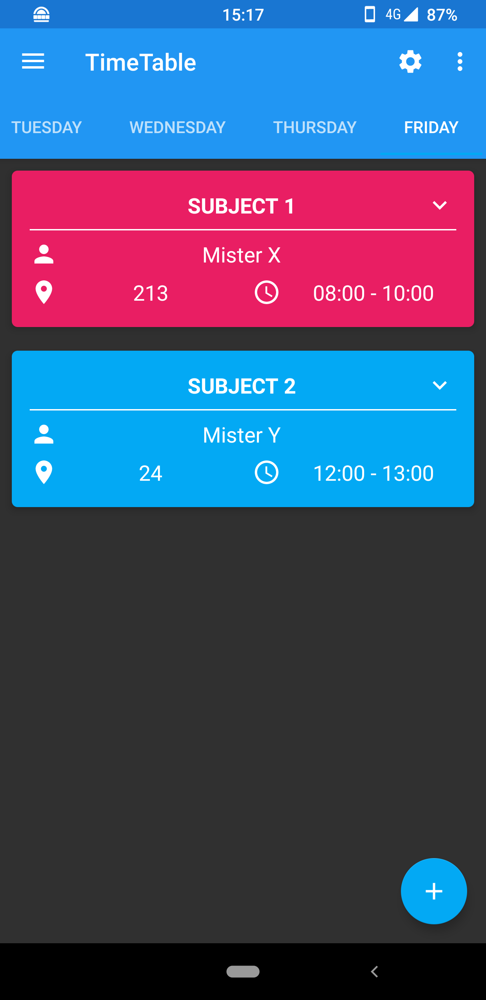
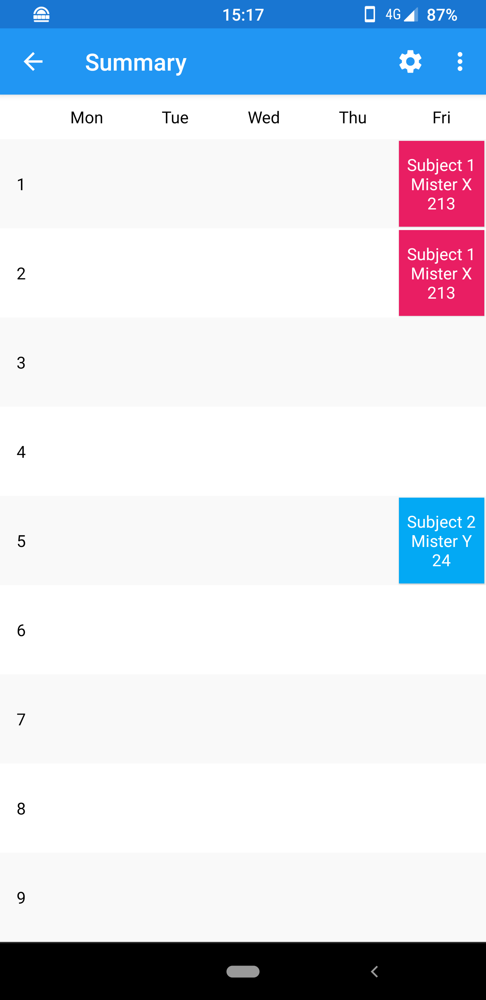
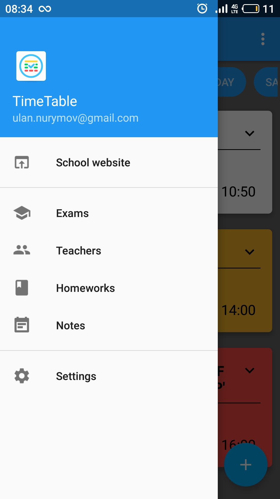
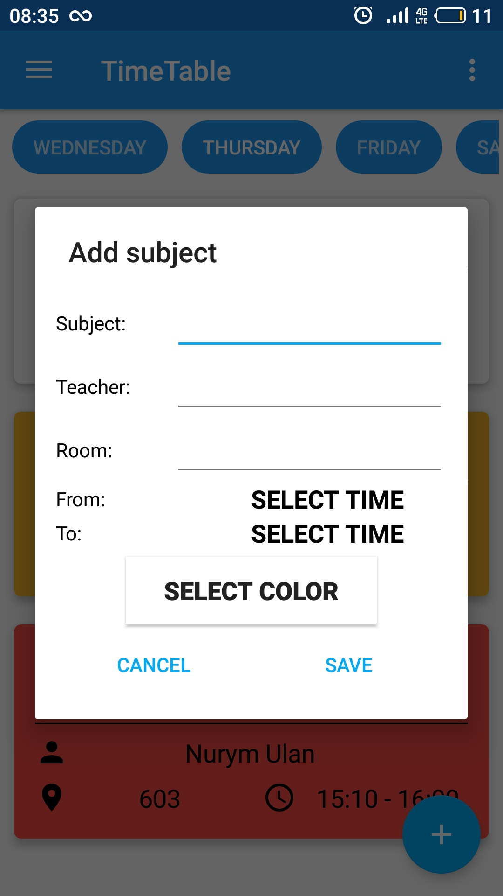
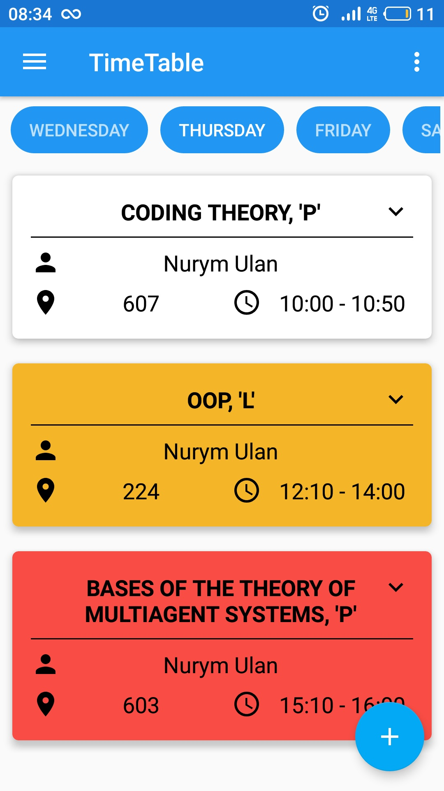

<h1 align=center>

</h1>
Important: We moved to <a href="https://gitlab.com/asdoi/TimeTable">GitLab</a>! The repository on Github will remain as a mirror. Please do not submit pull requests or issues on GitHub.

# TimeTable

  

  

*

Timetable is an Android Application, which allows you to save timetable, homeworks and notes. 
This is an improved version of the <a href="https://github.com/ulan17/TimeTable">app from ulan17 </a>. 
With this app you can manage your timetable, your homework, exams, teachers or notes. 
The app also automatically switches your phone to do-not-disturb mode during classes and back again afterwards. 
In addition, it always shows you a notification with your next subject. 

Some other features I added:
<ul><li>New Notifications (also about the current lesson)</li><li>Weekly View</li><li>Automatically turn on/off Do-Not-Disturb</li><li>Dark mode</li><li>Backup/Restore</li><li>Shortcuts</li><li>Splash Screen</li><li>And some onClick Intents, e.g. If you click the phone number in the teacher-activity the phone app will be opened</li><li>Some more little ui changes</li></ul>

### Contribute

You are welcome to contribute with issues, pull requests and ideas. And to contribute to this project, please fork the project and submit a pull request. 

### Todo:
 - Add a print option
 - Backup all profiles
 - Rewrite Database to RoomDB
 - Rewrite class 'AlertDialogsHelper'

### Screenshots
 &nbsp;&nbsp;&nbsp;&nbsp; 
 
&nbsp;&nbsp;&nbsp;&nbsp; &nbsp;&nbsp;&nbsp;&nbsp; 

*Made by <a href="https://github.com/smichel17">smichel17</a> from <a href="https://github.com/LibreShift/red-moon">LibreShift/red-moon</a>

### License

The source code is licensed under the [GNU v3 Public License](https://github.com/ulan17/TimeTable/blob/master/LICENSE). 
